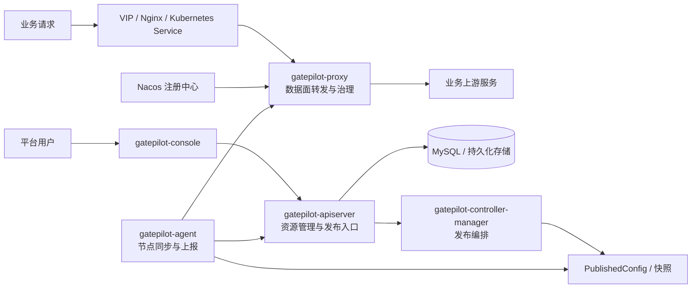

# GatePilot

<div align="center">

**面向平台团队的云原生网关控制系统**

把项目接入、路由转发、流量治理、蓝绿灰度、配置发布、运行诊断和审计追踪收敛到一个统一平台里。

[](https://github.com/tryfovik/gatepilot/actions/workflows/ci.yml)
[](https://openjdk.org/projects/jdk/17/)
[](https://spring.io/projects/spring-cloud-gateway)
[](https://vuejs.org/)
[](https://nacos.io/)
[](LICENSE)

[快速开始](docs/QUICKSTART.md) · [架构说明](docs/ARCHITECTURE.md) · [Kubernetes 部署](deploy/kubernetes/README.md) · [Console](gatepilot-console/README.md) · [路线图](docs/ROADMAP.md) · [贡献指南](CONTRIBUTING.md)

</div>


GatePilot 是给平台工程团队、网关团队和 SRE 团队使用的平台级网关控制系统。它不是一个只会转发请求的代理，也不是把配置字段铺满页面的后台，而是一套接近 Kubernetes 控制面 / 数据面思想的网关平台：控制面管理期望状态和发布闭环，数据面专注承载业务流量，Console 让接入、发布和排障都能被看见、被操作、被追踪。

## 为什么需要 GatePilot

当公司接入的项目越来越多时，网关最先变复杂：

- 路由、上游、认证、限流、重试、熔断、染色、蓝绿和灰度配置散在各处
- 发布一次网关配置不知道影响哪些项目，失败后不知道哪些节点应用成功
- 下游服务实例很多，IP 会变化，让用户手工维护上游地址很容易失控
- 节点扩容后配置同步不可见，出了问题很难确认当前版本、last-good 和上游健康
- 审计、诊断、TraceId、运行事件缺少统一入口，排障依赖人工翻日志

GatePilot 希望把这些能力做成一个长期可维护的平台：项目按资源接入，配置可校验可发布，策略在数据面本地执行，运行状态持续上报，出现问题时能从 Console 直接定位到路由、上游、节点和版本。

## 核心能力

| 能力 | GatePilot 怎么做 |
| --- | --- |
| 项目接入 | 通过中文 Console 创建项目、命名空间、团队、环境、入口域名、路由、上游和策略 |
| 路由转发 | 复用 Spring Cloud Gateway 的成熟转发能力，避免手写低层 HTTP 转发 |
| 服务发现 | 支持 Nacos 注册中心，上游引用服务名，实例扩缩容不需要维护 IP 清单 |
| 负载均衡 | 运行时使用 Spring Cloud LoadBalancer 做实例选择，固定端点只作为兜底模式 |
| 流量治理 | 支持限流、重试、熔断、fallback、HTTP 方法控制、染色和治理策略组合 |
| 蓝绿灰度 | 支持稳定上游、候选上游、权重分流、染色命中和切换发布 |
| 配置发布 | 支持 dry-run、发布请求、PublishedConfig、配置快照、节点应用结果和版本回滚 |
| 节点同步 | agent 负责节点注册、心跳、配置拉取、staged / last-good 和 apply 结果上报 |
| 运行诊断 | 提供类 Postman 的请求诊断工作台，解释路由命中、认证、染色、上游和治理结果 |
| 审计追踪 | 主链路轻量采集，异步批量上报，避免审计能力拖慢转发链路 |
| 多形态部署 | 支持一体化 jar，也支持 apiserver、controller-manager、agent、proxy、console 分服务部署 |

## Console 体验

GatePilot Console 默认中文优先，按照企业后台管理系统的使用习惯组织页面：

- **工作台**：查看项目、路由、节点、发布和审计概况
- **接入管理**：通过向导创建项目、路由、上游、治理和发布资源
- **流量配置**：管理路由目录、上游服务、流量策略、认证策略和发布策略
- **发布管理**：选择待发布项目执行 dry-run、发布、回滚并查看节点应用结果
- **运行观测**：查看 PublishedConfig、节点副本、心跳、last-good、上游健康和运行审计
- **平台配置**：管理命名空间、团队、环境、配置分片、隔离组、流量等级、入口域名、注册中心和动态参数
- **帮助文档**：内置培训手册，减少业务团队接入成本

复杂字段不会直接让用户看 JSON。Console 会把声明式资源拆成业务化表单、列表、抽屉、弹窗和向导，默认值尽量替用户填好，高级参数再展开配置。

## 架构概览



核心原则很简单：

- **业务请求只进数据面**：proxy 热路径不查数据库，不依赖 Console，不临时访问控制面
- **控制面只管管理**：资源存储、校验、版本、发布、回滚、权限和审计查询都属于控制面
- **agent 跟随数据面**：负责配置同步、last-good 缓存、节点心跳和 apply 结果
- **合包只做装配**：一体化 jar 可以同时启动所有能力，但 `gatepilot-app` 不写业务实现

更多设计细节见 [架构说明](docs/ARCHITECTURE.md)。

## 快速开始

GatePilot 依赖 GetBoot 的公共能力。第一次本地构建时，先安装 GetBoot，再构建 GatePilot：

```bash
git clone https://github.com/tryfovik/getboot.git
git clone https://github.com/tryfovik/gatepilot.git

cd getboot
mvn -q -DskipTests install

cd ../gatepilot
mvn -q -DskipTests package
```

启动 Console：

```bash
cd gatepilot-console
npm install
npm run dev
```

默认访问：

```text
http://127.0.0.1:5174
```

Console 默认把 `/api/gatepilot` 代理到 `http://127.0.0.1:18080`。完整本地体验请参考 [快速开始](docs/QUICKSTART.md)。

## Demo 上游

项目内置 `gatepilot-demo-upstream`，用于验证真实转发、路径处理、Trace 透传、染色和蓝绿 / 灰度策略。同一个 jar 可以启动 stable 和 green 两个实例：

```bash
java -jar gatepilot-demo-upstream/target/gatepilot-demo-upstream.jar --spring.profiles.active=stable
java -jar gatepilot-demo-upstream/target/gatepilot-demo-upstream.jar --spring.profiles.active=green
```

| 实例 | 默认端口 | 用途 |
| --- | --- | --- |
| stable | `19081` | 稳定版本上游 |
| green | `19082` | 绿色 / 候选版本上游 |

## 模块边界

| 模块 | 职责 |
| --- | --- |
| `gatepilot-domain` | 声明式资源模型、枚举和值对象 |
| `gatepilot-apiserver` | 管理 API、资源存储、模板渲染、发布入口、快照、审计和 agent 协议 |
| `gatepilot-controller-manager` | 发布 reconcile、配置快照生成、发布状态聚合 |
| `gatepilot-agent` | 节点注册、心跳、配置拉取、last-good、proxy apply 协调和状态上报 |
| `gatepilot-proxy` | 基于 Spring Cloud Gateway 的数据面转发、治理执行和审计采集 |
| `gatepilot-console` | Vue 管理控制台，只调用 apiserver API |
| `gatepilot-embedded` | 单体模式下的进程内装配适配 |
| `gatepilot-app` | 一体化启动包，只负责装配，不写业务实现 |
| `gatepilot-demo-upstream` | 示例业务上游，用于演示和验收网关转发链路 |

## 生产部署建议

- 控制面接 MySQL 持久化资源、发布请求、快照、事件和审计查询数据
- Nacos 作为默认服务发现来源，下游服务扩缩容由注册中心维护
- proxy 按流量水平横向扩副本，agent 跟随 proxy 部署
- controller-manager 多副本部署时使用 GetBoot 分布式锁，避免重复推进发布
- 限流、熔断、审计、TraceId 等公共能力优先接入 GetBoot，不在 GatePilot 里重复造轮子
- Kubernetes 环境推荐入口链路：`Client -> VIP / Nginx -> Kubernetes Service -> gatepilot-proxy -> Upstream`

## GitHub Topics

建议仓库保持这些 Topics，方便别人搜索到：

`api-gateway` `spring-cloud-gateway` `gateway` `nacos` `blue-green-deployment` `canary-release` `traffic-governance` `kubernetes` `vue` `platform-engineering`

## 工程约定

- 公共能力优先复用 GetBoot，缺公共能力先补 GetBoot，再让 GatePilot 接入
- 后端按 DDD 分层：`interfaces / application / domain / infrastructure`
- 数据面热路径不能访问控制面和数据库
- Console 只调用 apiserver API，不直连数据库、agent 或 proxy
- 一体化启动包只做装配，不写业务实现
- Java 文件统一 Apache License Header，使用 Maven license 插件校验

## 参与项目

欢迎提交 Issue、Discussion 或 Pull Request。开始前建议先阅读：

- [贡献指南](CONTRIBUTING.md)
- [安全策略](SECURITY.md)
- [路线图](docs/ROADMAP.md)

GatePilot 的目标是成为团队可以长期依赖的网关平台：接入项目更轻，发布更稳，扩容更自然，排障更从容。
