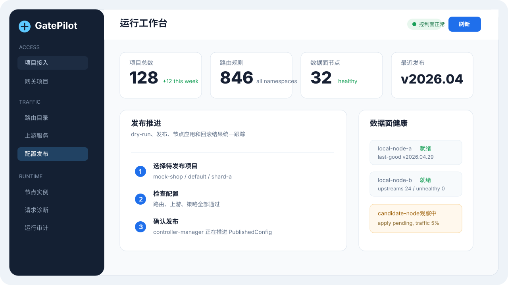
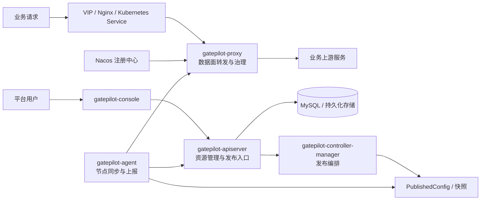

# GatePilot

<div align="center">

**平台级网关控制面与数据面系统**

面向平台、网关和 SRE 团队，统一管理项目接入、路由转发、流量治理、蓝绿灰度、配置发布、节点同步和运行诊断。少一些临场发挥，多一些可验证的发布闭环。

[](https://github.com/tryfovik/gatepilot/actions/workflows/ci.yml)
[](https://openjdk.org/projects/jdk/17/)
[](https://spring.io/projects/spring-cloud-gateway)
[](https://vuejs.org/)
[](https://nacos.io/)
[](LICENSE)

[在线演示](http://81.71.128.146/index.html) · [快速开始](docs/QUICKSTART.md) · [架构说明](docs/ARCHITECTURE.md) · [Kubernetes 部署](deploy/kubernetes/README.md) · [Console](gatepilot-console/README.md) · [路线图](docs/ROADMAP.md)

</div>



在项目数量不多时，网关配置通常还能靠少量文件和人工约定维持秩序。规模上来之后，路由、上游、认证、限流、重试、熔断、染色、蓝绿、灰度、发布、回滚和审计会迅速分散到不同系统和不同人的经验里。真正出问题时，团队最需要的不是再多一份配置，而是能立刻回答几个问题：这个请求命中了哪条路由，去了哪个上游，为什么被治理策略拦住，哪些节点已经应用了新版本。

GatePilot 的设计目标，就是把这些网关运行时和管理侧问题收敛成一套有边界、有状态、有流程的系统。控制面负责管理和发布，数据面负责承载流量，agent 负责节点同步，Console 负责让人看得懂、查得到、改得稳。

## 适合谁

- **平台工程团队**：希望把项目接入、配置治理和发布流程做成标准平台能力
- **网关 / 中间件团队**：需要支撑多项目、高并发、多副本数据面和统一管理入口
- **SRE / 运维团队**：关注发布回滚、节点同步、故障定位、审计追踪和运行状态
- **业务研发团队**：希望通过控制台完成接入和发布，把注意力留给业务本身

## 核心能力

| 场景 | GatePilot 的处理方式 |
| --- | --- |
| 项目接入 | 使用中文 Console 创建项目、命名空间、团队、环境、入口域名、路由、上游和策略 |
| 路由转发 | 基于 Spring Cloud Gateway 承接成熟转发能力，避免重复维护底层 HTTP 转发逻辑 |
| 上游发现 | 支持 Nacos，生产环境按注册中心服务名接入，避免人工维护大规模 IP 清单 |
| 负载均衡 | 运行时交给 Spring Cloud LoadBalancer 选择实例，固定端点用于 demo、兜底和特殊网络场景 |
| 流量治理 | 支持限流、重试、熔断、fallback、HTTP 方法控制、染色和策略组合 |
| 蓝绿灰度 | 支持稳定上游、候选上游、权重分流、染色命中和切换发布 |
| 配置发布 | 支持 dry-run、发布请求、PublishedConfig、配置快照、节点应用结果和回滚 |
| 节点同步 | agent 负责注册、心跳、配置拉取、staged / last-good 和 apply 结果上报 |
| 运行诊断 | 提供类 Postman 的请求诊断工作台，解释路由、认证、染色、治理和上游命中结果 |
| 审计追踪 | 主链路轻量采集，异步批量上报；审计要帮助排障，不能成为新的性能问题 |

## Console 体验

GatePilot Console 默认中文优先，采用企业后台管理系统的交互方式：信息密度适中，操作路径清楚，关键结果可追踪。它不追求炫技，也不把复杂字段直接推给用户。

- **工作台**：项目、路由、节点、发布和审计概况
- **接入管理**：通过向导创建项目、路由、上游、治理和发布资源
- **流量配置**：管理路由目录、上游服务、流量策略、认证策略和发布策略
- **发布管理**：选择待发布项目，执行 dry-run、发布、回滚并查看节点应用结果
- **运行观测**：查看 PublishedConfig、节点副本、心跳、last-good、上游健康和运行审计
- **平台配置**：管理命名空间、团队、环境、配置分片、隔离组、流量等级、入口域名、注册中心和动态参数
- **帮助文档**：内置培训手册，降低业务团队第一次接入的理解成本

复杂配置会尽量用表单、选择器、向导和预览来表达。能提供默认值的字段先默认，确实需要控制的参数再展开。能选择已有资源的地方不鼓励临时手填，毕竟“临时”这个词在配置系统里通常不太临时。

## 架构概览



模块边界先固定，系统后续才不容易膨胀成一个“什么都能放”的包：

- **控制面管配置**：资源存储、查看、校验、版本、发布、回滚、权限和审计查询
- **数据面管流量**：路由、转发、限流、熔断、重试、染色、蓝绿 / 灰度执行和审计采集
- **agent 管同步**：节点注册、心跳、配置拉取、last-good、apply 状态和健康上报
- **Console 管体验**：项目如何接入，配置如何发布，问题如何定位
- **app 只做装配**：一体化 jar 可以同时启动所有能力，但不承载业务实现

更多细节见 [架构说明](docs/ARCHITECTURE.md)。

## 快速开始

GatePilot 复用 GetBoot 的公共能力。第一次本地构建时，先安装 GetBoot，再构建 GatePilot：

```bash
git clone https://github.com/tryfovik/getboot.git
git clone https://github.com/tryfovik/gatepilot.git

cd getboot
mvn -q -DskipTests install

cd ../gatepilot
mvn -q -DskipTests package
```

启动 Console：

```bash
cd gatepilot-console
npm install
npm run dev
```

默认访问：

```text
http://127.0.0.1:5174
```

Console 默认把 `/api/gatepilot` 代理到 `http://127.0.0.1:18080`。完整本地体验见 [快速开始](docs/QUICKSTART.md)。

## 在线演示

当前演示地址：

```text
http://81.71.128.146/index.html
```

该地址用于查看 Console 和基础链路。根路径目前由网关接管，访问页面请使用上面的 `index.html`。

## Demo 上游

项目内置 `gatepilot-demo-upstream`，用于验证真实转发、路径处理、Trace 透传、染色和蓝绿 / 灰度策略。同一个 jar 可以启动 stable 和 green 两个实例：

```bash
java -jar gatepilot-demo-upstream/target/gatepilot-demo-upstream.jar --spring.profiles.active=stable
java -jar gatepilot-demo-upstream/target/gatepilot-demo-upstream.jar --spring.profiles.active=green
```

| 实例 | 默认端口 | 用途 |
| --- | --- | --- |
| stable | `19081` | 稳定版本上游 |
| green | `19082` | 绿色 / 候选版本上游 |

## 模块边界

| 模块 | 职责 |
| --- | --- |
| `gatepilot-domain` | 声明式资源模型、枚举和值对象 |
| `gatepilot-apiserver` | 管理 API、资源存储、模板渲染、发布入口、快照、审计和 agent 协议 |
| `gatepilot-controller-manager` | 发布 reconcile、配置快照生成、发布状态聚合 |
| `gatepilot-agent` | 节点注册、心跳、配置拉取、last-good、proxy apply 协调和状态上报 |
| `gatepilot-proxy` | 基于 Spring Cloud Gateway 的数据面转发、治理执行和审计采集 |
| `gatepilot-console` | Vue 管理控制台，只调用 apiserver API |
| `gatepilot-embedded` | 单体模式下的进程内装配适配 |
| `gatepilot-app` | 一体化启动包，只负责装配，不写业务实现 |
| `gatepilot-demo-upstream` | 示例业务上游，用于演示和验收网关转发链路 |

## 生产部署建议

- 控制面接 MySQL 持久化资源、发布请求、快照、事件和审计查询数据
- Nacos 作为默认服务发现来源，下游服务扩缩容由注册中心维护
- proxy 按流量水平横向扩副本，agent 跟随 proxy 部署
- controller-manager 多副本部署时使用 GetBoot 分布式锁，避免重复推进发布
- 限流、熔断、审计、TraceId 等公共能力优先接入 GetBoot，不在 GatePilot 里重复实现
- Kubernetes 环境推荐入口链路：`Client -> VIP / Nginx -> Kubernetes Service -> gatepilot-proxy -> Upstream`

## 参与项目

欢迎提交 Issue、Discussion 或 Pull Request。开始前建议先看：

- [贡献指南](CONTRIBUTING.md)
- [安全策略](SECURITY.md)
- [路线图](docs/ROADMAP.md)

GatePilot 的目标很朴素：让项目接入更标准，让配置发布更可控，让线上排障少一点猜测。
