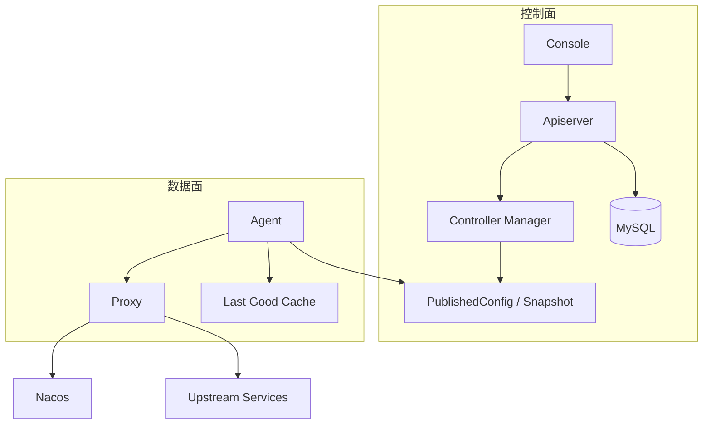
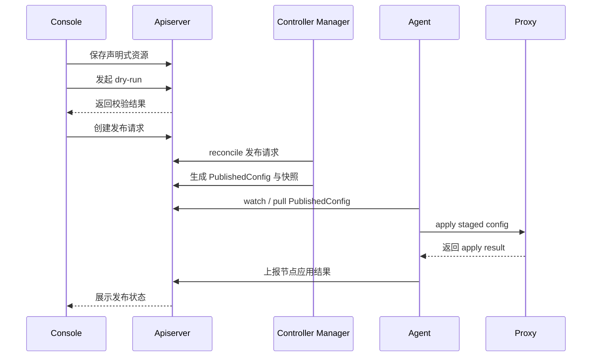

# GatePilot 架构说明

GatePilot 采用接近 Kubernetes 的控制面 / 数据面思想。控制面保存期望状态并负责编译发布，数据面只消费已发布运行态并处理业务流量。

## 总体模型

## 控制面职责

控制面负责配置和发布，不承接业务请求：

- 声明式资源保存、查看、校验和版本管理
- 项目、路由、上游、策略、注册中心、动态参数等资源的管理 API
- 发布请求、dry-run、PublishedConfig、配置快照和回滚
- 节点状态、运行审计、控制面事件和诊断查询
- 权限、操作审计和控制台 API

## 数据面职责

数据面负责业务请求转发和本地治理，不编辑配置：

- 路由匹配、路径处理和上游转发
- 限流、熔断、重试、fallback、染色、蓝绿和灰度执行
- 认证策略执行和 TraceId 透传
- Nacos 实例订阅、实例快照和 Spring Cloud LoadBalancer 选址
- 运行审计轻量采集和异步上报

## Agent 职责

agent 跟随 proxy 节点部署，是控制面和数据面之间的同步层：

- 节点注册和心跳
- 拉取 PublishedConfig
- 校验并写入 staged config
- 通知 proxy 原子切换运行态
- 保存 last-good 配置
- 上报 apply 结果、当前版本、健康摘要和上游健康

## 发布流程

## 服务发现与负载均衡

生产主路径是 Nacos：

- 管理员在 Console 创建注册中心资源
- 上游资源选择注册中心并填写服务名
- controller-manager 把服务发现引用编译进 PublishedConfig
- proxy 后台订阅 Nacos 实例变化
- 请求热路径读取本地实例快照，再交给 Spring Cloud LoadBalancer 选择实例

固定端点仍然保留，但定位是 demo、老项目兜底和特殊网络场景，不作为大规模生产默认方式。

## 模块边界

| 模块 | 边界 |
| --- | --- |
| `gatepilot-domain` | 资源模型、枚举和值对象，不依赖 Web 和持久化实现 |
| `gatepilot-apiserver` | 管理 API 和资源存储，提供 Console、controller-manager、agent 协议 |
| `gatepilot-controller-manager` | 发布编排和状态推进，通过分布式锁保证多副本安全 |
| `gatepilot-agent` | 节点侧同步层，不处理管理页面和资源编辑 |
| `gatepilot-proxy` | 数据面运行时，只消费 PublishedConfig |
| `gatepilot-console` | 前端管理界面，只调用 apiserver |
| `gatepilot-app` | 一体化启动装配，不写业务逻辑 |

## 扩容原则

控制面和数据面可以分别扩容：

- apiserver 多副本承接 Console、agent 和 controller-manager 请求
- controller-manager 多副本通过分布式锁避免重复 reconcile
- proxy 按流量水平横向扩副本
- agent 跟随 proxy 节点部署，独立上报当前版本和健康状态
- 配置分片用于降低单个发布批次和单个数据面集群的配置压力

业务流量增长时，优先扩 proxy 副本和上游服务副本，不需要改 GatePilot 代码。
